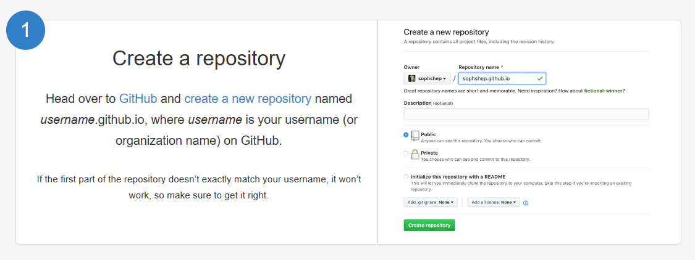
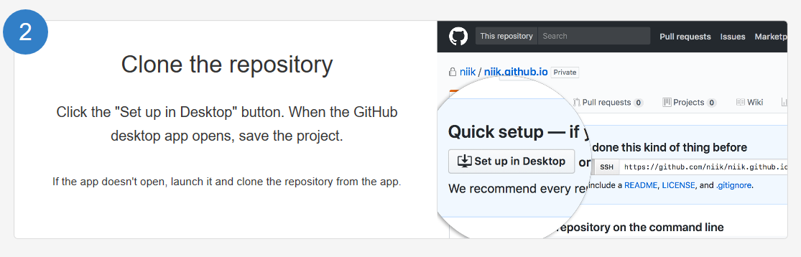
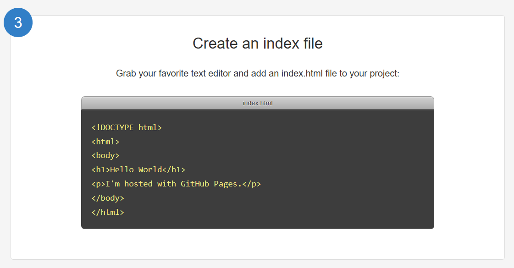
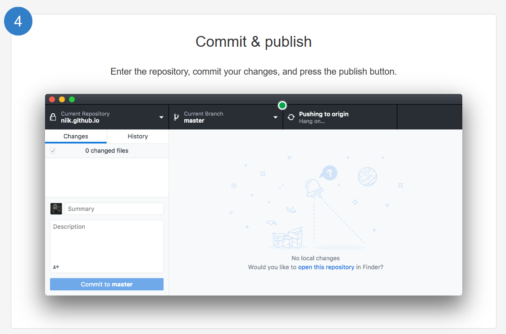
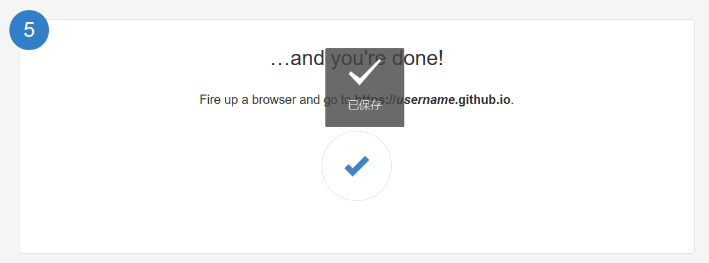
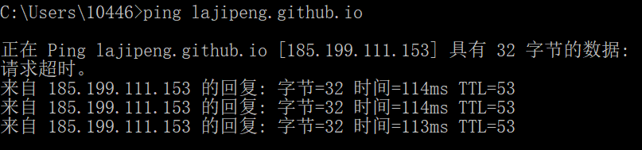
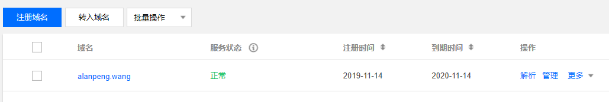
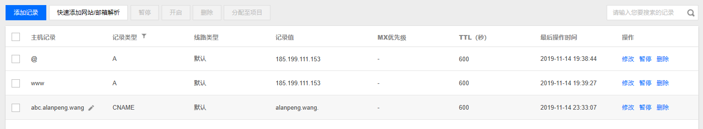

# 个人网页设计报告

[TOC]


#### 1、整体设计

我的个人网页分为6个部分，各个部分详细功能如下：

| 模块           | 功能：                                                   |
| -------------- | :------------------------------------------------------- |
| About me       | 展示个人基本信息，姓名、导师、研究兴趣、掌握技能等       |
| Download       | 提供下载个人简历、个人陈述的链接                         |
| News           | 展示个人最近的动态新闻，如篮球比赛、出国交流、朋友聚会等 |
| Github Profile | 展示我的Github主页，下拉框展示一些有贡献的项目           |
| Directions     | 展示我的办公地点的地理位置                               |
| Contact me     | 对来客信息进行统计、提供联系方式                         |

#### 2、设计过程

##### （1）导航栏

为了使得导航栏的设计美观和简便，我引入了bootstrap关于导航的组件。

参考博客：

[参考实例](https://www.runoob.com/try/try.php?filename=bootstrap3-plugin-dropdown-defaultnavbar)

[深入理解BootStrap Item11 -- 导航页（navbar）](https://blog.csdn.net/i10630226/article/details/49848841)

###### 组件支持

```html
<link rel="stylesheet" href="https://maxcdn.bootstrapcdn.com/bootstrap/3.3.6/css/bootstrap-theme.min.css" integrity="sha384-fLW2N01lMqjakBkx3l/M9EahuwpSfeNvV63J5ezn3uZzapT0u7EYsXMjQV+0En5r" crossorigin="anonymous">
```

###### 代码描述


```html
<header class="container">
	<nav class="navbar navbar-default">
		<div class="container-fluid">
            <!-- 导航栏 -->
            <div class="navbar-header">
              <button type="button" class="navbar-toggle collapsed" data-toggle="collapse" data-target="#bs-example-navbar-collapse-1" aria-expanded="false">
                <span class="sr-only">Toggle navigation</span>
                <span class="icon-bar"></span>
                <span class="icon-bar"></span>
                <span class="icon-bar"></span>
              </button>
              <!-- index.html展示的内容是about me -->  
              <a class="navbar-brand" href="index.html"><b>About me</b></a>
            </div>
                   
			<!-- 收集用于切换的导航链接、表单和其他内容 -->
		    <div class="collapse navbar-collapse" id="avbar-collapse-1">
				<ul class="nav navbar-nav">
                    <!-- 定义一个下拉框，用于下载简历 -->
				    <li class="dropdown">
				    	<a href="https://github.com/lajipeng" class="dropdown-toggle" data-toggle="dropdown" role="button" aria-haspopup="true" aria-expanded="false"><b>Download</b><span class="caret"></span></a>
                        <ul class="dropdown-menu">
                          <li><a href="./resources/wp.pdf" class="cvLink myResumeText">My Resume</a></li>
                        </ul>
                      <!-- index2.html的功能是展示我的动态 -->
				   <li><a href="index2.html"><b>News</b></a></li>
                    
                   <!-- 展示我的Github主页 -->
				   <li class="dropdown">
				   		<a href="https://github.com/lajipeng" class="dropdown-toggle" data-toggle="dropdown" role="button" aria-haspopup="true" aria-expanded="false"><b>GitHub Profile</b><span class="caret"></span></a>
				        <ul class="dropdown-menu">
				            <li><a href="https://github.com/lajipeng/DicomToMhd">DicomToMhd</a></li>
				            <li role="separator" class="divider"></li>
				            <li><a href="https://github.com/lajipeng/Liver-image-registration-master">Liver-image-registration</a></li>
				            <li role="separator" class="divider"></li>
				            <li><a href="https://github.com/lajipeng/Voice-Beautification">Voice-Beautification</a></li>
				            <li role="separator" class="divider"></li>
				            <li><a href="https://github.com/lajipeng/exercise">Exercise for ML</a></li>
				            <li role="separator" class="divider"></li>
				            <li><a href="https://github.com/lajipeng/Analysis-of-Median-Average-Gaussian-filter-on-denoising-">Analysis-of-Median-Average-Gaussian-filter-on-denoising</a></li>
				          </ul>
				        </li>
				      </ul>
				  <form class="navbar-form navbar-left" role="search">
				      <div class="form-group">
                      <!-- 搜索框 -->
				          <input type="text" class="form-control" placeholder="Search">
				      </div>
                      <!-- 提交按钮 -->
				      <button type="submit" class="btn btn-default">Submit</button>
				  </form>
                        
                  <!-- 另定义一个位于右边的导航栏 -->
				  <ul class="nav navbar-nav navbar-right">
                        <!-- 提供地理位置的谷歌链接 -->
				        <li><a href="https://www.google.com/maps/place/中国上海市杨浦区五角场复旦大学科学楼/@31.2997737,121.500591,17z/data=!3m1!4b1!4m5!3m4!1s0x35b273cf62733217:0xbc57ffbf47d03162!8m2!3d31.2997737!4d121.502785?hl=zh-CN"><b>Directions</b></a></li>
                        <!-- index3.html是收集访客信息的一个网页 -->
				        <li class="dropdown">
				          <a href="index3.html" class="dropdown-toggle" data-toggle="dropdown" role="button" aria-haspopup="true" aria-expanded="false"><b>Contact Me</b><span class="caret"></span></a>
				          <ul class="dropdown-menu">
				            <li><a href="#">Email - wangp16@fudan.edu.cn</a></li>
				            <li role="separator" class="divider"></li>
				            <li><a href="#">Phone - 18916593193</a></li>
				          </ul>
				        </li>
				  </ul>
			</div>
		</div>
	</nav>  
</header>
```


###### 重要功能解释

创建一个默认的导航栏的步骤如下：

- 向 <nav> 标签添加 class **.navbar、.navbar-default**。
- 向 <div> 元素添加一个标题 class **.navbar-header**，内部包含了带有 class **navbar-brand** 的 <a> 元素。这会让文本看起来更大一号。
- 为了向导航栏添加链接，只需要简单地添加带有 class **.nav、.navbar-nav** 的无序列表即可。

向标签添加下拉菜单的步骤如下：

- 添加带有**.dropdown** class 开始。
- 添加带有 **.dropdown-menu** class 的无序列表。
- 下拉菜单有多个对象需要用‘role="separator" class="divider"’分开

使用container还是.container-fluid：

- .container类出现内边距和外边距，.container-fluid类没有。
- .container类左右内边距一直是15px，屏幕小于等于767px的时候没有margin值，屏幕大于767px开始有左右margin值，屏幕宽度为768px和1000px的时候，margin值相对最小，分别是9px和15px，其他时候margin值随着屏幕的增大而增大。.container-fluid类宽度不管屏幕宽度大小，一直是100%。
  
  

##### （2）About me

展示个人基本信息，姓名、导师、研究兴趣、掌握技能等

###### 组件支持

```html
<!--为实现打字的动态展示jQuery first, then scipt.js, then typist JS-->
<script src="js/jquery-3.2.1.min.js"></script>
<script src="js/typist.min.js"></script>
<script src="js/scripts.js"></script>
<!--css1是我自己定义的层叠样式表-->
<link rel="stylesheet" href="./css1.css"/>
```

###### 代码描述

<!--Html-->

```html
<section id="About me">
	
		<h1>Hi, I'm Alan.</h1>
			<p>
				<span class="typist" data-typist="My friend, Nice to meet you">Welcome!</span>
			</p>
		
		<h2>Wang Peng</h2>
			<p>An Undergraduate of Electronic Engineering Department of Fudan University </p>
		<h2>Supervisor</h2>
			<nav>
				<a href="http://ee.fudan.edu.cn/Data/View/847"><b>Yuanyuan Wang</b></a>
			</nav>
		<h2>Research Interest</h2>
			<p>Medical Image Processing, Learning (artificial intelligence), Abdominal CT, Liver Cancer, Image Reconstruction, Medical Disorders,</p>
		<h2>Skills</h2>
			<p>
             <ul class="skills">
          		<li>HTML</li>
          		<li>CSS</li>
          		<li>JavaScript</li>
         		<li>C++</li>
          		<li>Matlab</li>
          		<li>Python</li>
       		 </ul>
            </p>
</section>
```

<!--CSS-->

```css
<!--在处理个人照片用到的css样式规定-->
.img-fluid {
  max-width: 100%;
  height: auto; }
.rounded-circle {
  border-radius: 50% !important; }
.img-profile {
  max-width: 175px; }
/* Skills的方框展示效果 */
ul.skills {
  padding: 0;
  text-align: center;
}

.skills li {
  border-radius: 6px;
  display: inline-block;
  background: #ff9904;
  color: white;
  padding: 5px 10px;
  margin: 2px;
}

.skills li:nth-child(odd) {
  background: #0399ff;
}
/* 展现打字过程 */
@keyframes blink {
  0% {
    opacity: 1.0; }
  50% {
    opacity: 0.0; }
  100% {
    opacity: 1.0; } }

@-webkit-keyframes blink {
  0% {
    opacity: 1.0; }
  50% {
    opacity: 0.0; }
  100% {
    opacity: 1.0; } }

.typist .selectedText {
  display: none; }

.typist:after {
  position: relative;
  top: 7px;
  display: inline-block;
  height: 30px;
  margin-left: 5px;
  content: " ";
  -webkit-animation: blink .5s step-end infinite alternate;
  animation: blink .5s step-end infinite alternate;
  border-right: 2px solid; }
```


###### 重要功能解释

- HTML 标题（Heading）是通过<h1> - <h6> 标签来定义的.

- HTML 段落是通过标签 <p> 来定义的.

- HTML 链接是通过标签 <a> 来定义的.

- HTML 图像是通过标签  来定义的.

- <section> 标签定义文档中的节（section、区段）。比如章节、页眉、页脚或文档中的其他部分。

- <a> 标签定义超链接，用于从一张页面链接到另一张页面。<a> 元素最重要的属性是 href 属性，它指示链接的目标。

- <li> 标签定义列表项目。<li> 标签可用在有序列表 (<ol>) 和无序列表 (<ul>) 中。

##### （3) News

展示个人最近的动态新闻，如篮球比赛、出国交流、朋友聚会等

参考链接：

[**HTML图片居中显示**](https://blog.csdn.net/lxl51666/article/details/78996813)

[**Bootstrap** **轮播（Carousel）插件**](https://www.cnblogs.com/storebook/p/8479990.html)

###### 组件支持

```html
<!--为实现图片轮播所需要的.js文件-->
<script src="js/jquery-3.1.1.min.js"></script>
<script src="js/bootstrap.min.js"></script>
```

###### 代码描述

```html
<section class="text-center">
        <!-- 实现图像轮播 --> 
        <div class="portitemdiv">
            <div id="portcar" class="carousel slide" data-ride="carousel">
            <!-- 轮播（Carousel）指标 -->
				<ol class="carousel-indicators">
				<li data-target="#myCarousel" data-slide-to="0" class="active"></li>
				<li data-target="#myCarousel" data-slide-to="1"></li>
				<li data-target="#myCarousel" data-slide-to="2"></li>
				</ol> 
            <!-- 轮播（Carousel）项目 -->
            <div class="carousel-inner" role="listbox">
                <div class="item active">
                	<h1>Participat in the exchange activity of Fudan university</h1>
                 	<a style="cursor:pointer"></a>
                </div>
                <div class="item">
                	<h1>Play basketball competitions！</h1>
                 	<a style="cursor:pointer"></a>
                </div>
                <div class="item">
                <h1>Watch the movie 'China Captain' with friends from the party branch</h1>
                 	<a style="cursor:pointer"></a>
                </div>
              </div>
              <!-- 轮播（Carousel）导航 -->
              <a class="left carousel-control" href="#portcar" role="button" data-slide="prev">
                <span class="glyphicon glyphicon-chevron-left"></span>
                <span class="sr-only">Previous</span>
              </a>
              <a class="right carousel-control" href="#portcar" role="button" data-slide="next">
                <span class="glyphicon glyphicon-chevron-right"></span>
                <span class="sr-only">Next</span>
              </a>
            </div>
         </div>
</section>
```

###### 重要功能解释

-  是空标签，意思是说，它只包含属性，并且没有闭合标签。 要在页面上显示图像，你需要使用源属性（src）。src 指 "source"。源属性的值是图像的 URL 地址。alt 属性用来为图像定义一串预备的可替换的文本。height（高度） 与 width（宽度）属性用于设置图像的高度与宽度。指定图像的高度和宽度是一个很好的习惯。如果图像指定了高度宽度，页面加载时就会保留指定的尺寸。如果没有指定图片的大小，加载页面时有可能会破坏HTML页面的整体布局。
- Bootstrap 轮播（Carousel）插件是一种灵活的响应式的向站点添加滑块的方式。除此之外，内容也是足够灵活的，可以是图像、内嵌框架、视频或者其他您想要放置的任何类型的内容。如果您想要单独引用该插件的功能，则我们需要引用*bootstrap.min.js*

##### （4）Contact me

对来客信息进行统计

参考链接：

[**HTML5-表单**](https://cloud.tencent.com/developer/article/1487303)

###### 组件支持

无

###### 代码描述

```html
<!--访客信息采集-->
<section>
    <br>
    <h2 class="text-muted text-center">
		Hello, welcome to my personal-web-page.please leave your contact information<br>	</br>
        and what you want to tell me.
	</h2>
    <br></br>
    <br></br>
	<div class="container">
		<div class="row">
				<div>
					<form>
						<div class="row">
							<div class="col-md-6">
								<div class="form-group">
									<input type="text" class="form-control" placeholder="Your name">
								</div>
							</div>
							<div class="col-md-6">
								<div class="form-group">
									<input type="email"  class="form-control" placeholder="Your email address">
								</div>
							</div>
							<div class="col-md-6">
								<div class="form-group">
									<input type="tel"  class="form-control" placeholder="Phone number">
								</div>
							</div>
							<div class="col-md-6">
								<div class="form-group">
									<input type="url"  class="form-control" placeholder="Your website">
								</div>
							</div>
							<div class="col-md-6">
								<div class="form-group">
									<textarea rows="5"  class="form-control" placeholder="Short summary of the work"></textarea>
							</div>
                            <div class="text-center">
							<button class="btn btn-primary">Get A Free Quote</button>
						</div>
							</div>
						</div>
					</form>
			</div>
		</div>
	</div>
</section>
```

```CSS
<!--CSS-->
.row {
  display: -ms-flexbox;
  display: flex;
  -ms-flex-wrap: wrap;
      flex-wrap: wrap;
  margin-right: -15px;
  margin-left: -15px; }
  
.col-md-6 {
  position: relative;
  width: 100%;
  min-height: 1px;
  padding-right: 15px;
  padding-left: 15px; }
  
.form-group {
  margin-bottom: 1rem; }
```


###### 重要功能解释：

- <form>定义一个表单，.row,.col-md-6,.form-group class定义输入框格式，input可指定输入内容的格式

#### 3、Github上传网页

1、创建一个新的repository，命名为github用户名.github.io,并且将该repository设置为公开。



2、在本地Desktop客户端打开该项目。



3、将编辑完成的个人网页转移到该项目，或者创建一个新的index.html。



4、Commit并且push。



5、之后就可以通过http://username.github.io访问个人主页。



#### 4、购买域名绑定Github

###### 1.购买域名

首先在腾讯云购买一个域名，比如我根据我的中英文名字买了一个域名：alanpeng.wang

###### 2.在Github上绑定域名

在仓库里添加CNAME文件并在文件中填写绑定的域名，文件里填写的内容：要绑定的域名（不要包含Http://和www），如下图：


###### 3.添加域名解析

 ping你的http://xxxxx.github.io域名，得到一个IP地址185.199.111.153；
 windows操作系统下，快捷键win+R，然后输入cmd，弹出小黑框，然后输入ping lajipeng.github.io



###### 4.修改域名解析记录



然后转到如下页面，选择添加记录。一个主机记录为：“www”，一个为“@”；添加两个都是A记录；并用得到的IP填到记录值一栏。



###### 5.结果

这样通过https://alanpeng.wang就能访问到我的个人网页了。
 比如输入https://lajipeng.github.io/，结果地址栏会自动跳转到https://alanpeng.wang

#### 5、效果

###### Android端


###### PC端


